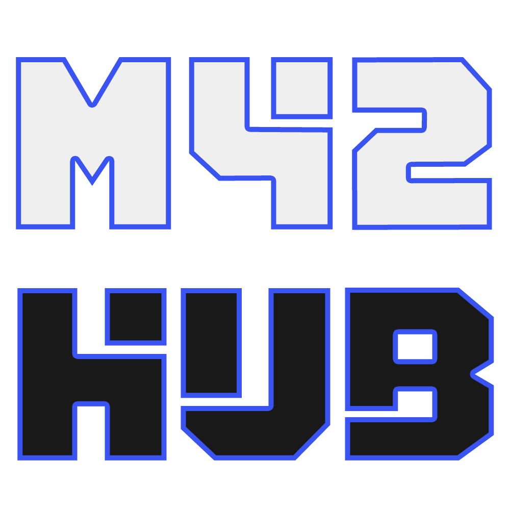

# 🚀 M42Hub - Client

<p align="center">
  
</p>

<p align="center">
  <strong>Conectando conhecimentos para criar algo incrível</strong>
</p>

<p align="center">
  <a href="https://github.com/m42hub/m42hub-client">
    
  </a>
  <a href="https://angular.io/">
    
  </a>
  <a href="https://www.typescriptlang.org/">
    
  </a>
  <a href="https://primeng.org/">
    
  </a>
  <a href="https://tailwindcss.com/">
    
  </a>
</p>

---

## 📝 Sobre o Projeto

O **M42Hub** é uma plataforma open-source que conecta pessoas com diferentes habilidades e conhecimentos para colaborar em projetos inovadores. Seja você um desenvolvedor, designer, músico, escritor, ilustrador ou apenas um entusiasta de tecnologia, aqui você encontra seu lugar para criar, aprender e crescer junto com uma comunidade colaborativa.

### 🎯 Missão

Acreditamos que cada pessoa tem algo único para oferecer. Nossa missão é criar um espaço onde talentos diversos se encontram para dar vida a ideias de todos os tipos e tamanhos, promovendo a colaboração verdadeira e o crescimento mútuo.

### ✨ Principais Funcionalidades

- 🔍 **Exploração de Projetos**: Descubra projetos interessantes para participar
- 💡 **Criação de Projetos**: Transforme suas ideias em realidade com a ajuda da comunidade
- 🏷️ **Categorização Inteligente**: Procure projetos por tópicos, ferramentas e complexidade
- 🔐 **Autenticação Segura**: Sistema completo de login e cadastro
- 🌓 **Tema Adaptável**: Interface que se adapta às suas preferências
- 📱 **Design Responsivo**: Experiência otimizada para todos os dispositivos
- 🎥 **Desenvolvimento Transparente**: Assista o projeto sendo construído nas [lives do BetGrave](https://www.youtube.com/@betgrave)!

## 🛠️ Tecnologias Utilizadas

### Frontend
- **[Angular 19](https://angular.io/)** - Framework principal
- **[TypeScript](https://www.typescriptlang.org/)** - Linguagem de programação
- **[PrimeNG](https://primeng.org/)** - Biblioteca de componentes UI
- **[TailwindCSS](https://tailwindcss.com/)** - Framework CSS utilitário

### Infraestrutura
- **[Angular SSR](https://angular.io/guide/ssr)** - Server-Side Rendering
- **[Docker](https://www.docker.com/)** - Containerização
- **[Docker Compose](https://docs.docker.com/compose/)** - Orquestração de containers

## 🚀 Começando

### Pré-requisitos

- **Node.js** (versão 20 ou superior)
- **npm** ou **yarn**
- **Git**
- **Docker** (opcional, para execução com containers)

### 📦 Instalação Local

1. **Clone o repositório**
   ```bash
   git clone https://github.com/m42hub/m42hub-client.git
   cd m42hub-client
   ```

2. **Instale as dependências**
   ```bash
   npm install
   ```

3. **Inicie o servidor de desenvolvimento**
   ```bash
   npm start
   # ou
   ng serve
   ```

4. **Acesse a aplicação**
   
   Abra seu navegador e acesse `http://localhost:4200`

### 🐳 Execução com Docker

1. **Build e execução com Docker Compose**
   ```bash
   docker-compose up --build
   ```

2. **Acesse a aplicação**
   
   A aplicação estará disponível em `http://localhost:4200`

### 🏗️ Build para Produção

```bash
# Build padrão
npm run build

# Build com SSR
npm run build:ssr

# Servir aplicação SSR
npm run serve:ssr
```

## 📁 Estrutura do Projeto

```
src/
├── app/
│   ├── components/          # Componentes reutilizáveis
│   │   ├── cards/          # Componentes de cartões
│   │   ├── forms/          # Formulários
│   │   ├── layout/         # Layout e navegação
│   │   ├── lists/          # Componentes de listagem
│   │   ├── modals/         # Modais e dialogs
│   │   └── sidebars/       # Barras laterais
│   ├── pages/              # Páginas principais
│   │   ├── home/           # Página inicial
│   │   ├── projects/       # Listagem de projetos
│   │   ├── project-details/# Detalhes do projeto
│   │   ├── project-editor/ # Editor de projetos
│   │   ├── login/          # Autenticação
│   │   └── sign-up/        # Cadastro
│   ├── services/           # Serviços e APIs
│   │   ├── auth/           # Autenticação
│   │   ├── project/        # Gestão de projetos
│   │   └── user/           # Gestão de usuários
│   ├── interfaces/         # Definições de tipos
│   ├── guards/             # Guards de rota
│   └── interceptors/       # Interceptadores HTTP
├── environments/           # Configurações de ambiente
└── assets/                # Recursos estáticos
```

## 🤝 Como Contribuir

Adoramos contribuições da comunidade! Veja como você pode ajudar:

### 1. 🐛 Reportar Bugs
- Use o [sistema de issues](https://github.com/m42hub/m42hub-client/issues)
- Descreva o problema detalhadamente
- Inclua steps para reproduzir o bug

### 2. 💡 Sugerir Features
- Abra uma issue com a tag `feature request`
- Explique o valor da funcionalidade para os usuários
- Forneça mockups ou exemplos se possível

### 3. 🔧 Contribuir com Código

1. **Fork o projeto**
2. **Crie uma branch para sua feature**
   ```bash
   git checkout -b feature/amazing-feature
   ```
3. **Faça suas alterações**
4. **Commit suas mudanças**
   ```bash
   git commit -m 'Add: amazing feature'
   ```
5. **Push para a branch**
   ```bash
   git push origin feature/amazing-feature
   ```
6. **Abra um Pull Request**
    - Vá para seu fork no GitHub
    - Clique em "New Pull Request"
    - **Aponte diretamente para a branch `main`** do repositório original
    - Descreva suas mudanças detalhadamente


### 📋 Padrões de Código

- Use **TypeScript** com tipagem estrita
- Siga as convenções do **Angular Style Guide**
- Mantenha os **componentes pequenos e focados**
- Escreva **testes** para novas funcionalidades (Se possível)
- Use **commits semânticos** (feat:, fix:, docs:, etc.)

### 🎥 Processo de Revisão

- **Todos os PRs são revisados ao vivo** no canal [BetGrave](https://www.youtube.com/@betgrave)! 📺
- Acompanhe as **live coding sessions** para ver seu código sendo analisado
- Em caso de conflitos durante a revisão, o autor será notificado para resolver para que possamos analisar corretamente
- Se houver problemas técnicos identificados durante a live, trabalharemos juntos para solucioná-los
- **Participe das lives** para aprender com outros contributors e melhorar suas skills!

## 🌍 Comunidade e Suporte

- 🎥 **YouTube**: Acompanhe as [live coding sessions](https://www.youtube.com/@betgrave) onde desenvolvemos o projeto juntos!
- 💬 **Discord**: [Junte-se à nossa comunidade](https://discord.gg/E5xy62Eus2)
- 🐛 **Issues**: [Reporte bugs ou sugira features](https://github.com/m42hub/m42hub-client/issues)


## 📊 Status do Projeto

🚧 **Open Beta** - O projeto está em desenvolvimento ativo. Funcionalidades podem mudar e novos recursos são adicionados regularmente.

<p align="center">
  Feito com ❤️ pela comunidade M42Hub
</p>

<p align="center">
  <a href="https://github.com/m42hub">
    
  </a>
  <a href="https://www.youtube.com/@betgrave">
    
  </a>
</p>
